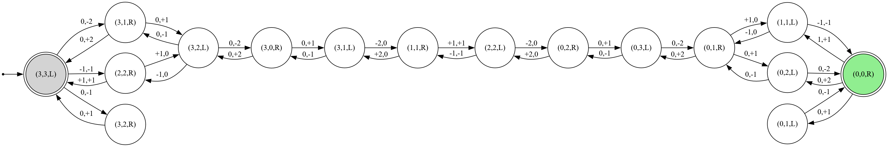

# Lösung Übungsblatt: Problemlösen, Suche

## Search.00: Bonus: Möglichkeiten und Grenzen sowie Auswirkungen der KI (2P)

- **ToDo**

## Search.01: Problemformalisierung, Zustandsraum

### 1. Formalisierung

### Objekte:

- Es gibt 2 Uferseiten $S$: 
    - $links: L$ 
    - $rechts: R$


- Es gibt 3 Elben $E$ und 3 Orks $O$
- Es gibt ein Pferd, welches die Uferseite $S$ nur wechseln kann, wenn es mindestens einen Elb oder einen Ork transportiert. Es kann höchstens 2 Wesen transportieren.

<br>

### Zustände:

- $\{ (E_L,O_L,S)\}$ mit:

    - $E_L \epsilon \{0;1;2;3\}$ ...Anzahl der Elben am linken Ufer
    - $O_L \epsilon \{0;1;2;3\}$ ...Anzahl der Orks am linken Ufer
    - $S \epsilon \{L;R\}$ ...Uferseite, an der das Pferd gerade steht

- Die Zustände des rechten Ufers ergeben sich daraus implizit und werden deshalb nicht explizit modelliert.

- Startzustand: $(3,3,L)$
- Zielzustand: $(0,0,R)$

<br>

### Aktionen:

- Das Pferd kann ein oder zwei Wesen von einer Uferseite auf die andere transportieren, es muss dabei die Uferseite wechseln. Dieser Zustandswechsel ist wie folgt definiert:

    - $ (\Delta E, \Delta O)$ mit:
        - $\Delta E, \Delta O \epsilon \{0;1;2\}$ falls das Pferd von ***links nach rechts*** geht. 
        
        <br>
        
        -  $\Delta E, \Delta O \epsilon \{0;-1;-2\}$ falls das Pferd von ***rechts nach links*** geht.

        <br>

        - $∣\Delta E∣ + ∣\Delta O∣∈{1,2}$

<br>

- Dabei findet ein Zustandswechsel statt, der wiefolgt definiert ist:

$$
(E_L,O_L,S) \xrightarrow{(\Delta E,\Delta O)} (E_L+\Delta E,O_L+\Delta O,S')
$$ 

<br>

-  Die zu transportierenden Wesen müssen am Ausgangsufer in entsprechender Menge vorhanden sein:

    

$$
E+\Delta E \ge 0, 
$$
$$
O+\Delta O \ge 0
$$

<br>

und die Uferseite muss bei einem Zustandswechsel immer gewechselt werden:


$$
\text{S}' =
\begin{cases}
R, & \text{wenn Seite} = L,\\
L, & \text{wenn Seite} = R
\end{cases}
$$

<br>

- An jedem Ufer muss die Anzahl der Elben zu jeder Zeit größer oder gleich der Anzahl der an diesem befindlichen Orks sein:


$$
E_L \ge O_L,
$$
$$
E_R \ge O_R
$$

### 2. Problemgraph

<br>

<picture><source media="(prefers-color-scheme: light)" srcset="images/ElfsAndOrks.png"><source media="(prefers-color-scheme: dark)" srcset="images/ElfsAndOrks.png"></picture>

<br>

## Search.02: Suchverfahren


<br>

Quelle: [MapGermanyGraph.svg](https://commons.wikimedia.org/wiki/File:MapGermanyGraph.svg)
by [Regnaron](https://de.wikipedia.org/wiki/Benutzer:Regnaron) and
[Jahobr](https://commons.wikimedia.org/wiki/User:Jahobr) on Wikimedia
Commons ([Public
Domain](https://en.wikipedia.org/wiki/en:public_domain))

<br>

|Stadt|*h(n)* in km|
|-|-|
|Augsburg|0|
|Erfurt|400|
|Frankfurt|100|
|Karlsruhe|10|
|Kassel|460|
|Mannheim|200|
|*München*|0|
|Nürnberg|537|
|Stuttgart|300|
|Würzburg|170|


<br>

**Allgemeine Anmerkung zu den Tabellen mit den Abläufen der Algorithmen:**

- In der Spalte `Bemerkung` wird notiert, welcher Knoten expandiert wird. Die Bemerkung `x Nachfolger gefunden` bezieht sich nur auf relevante Nachfolger, also solche, die keine Schleifen erzeugen.

### 1 a) Tiefensuche


- Datenstruktur: ***Stack***

<br>

|Schritt|Stack|Bemerkung|
|----|----|----|
|1.|[ **Wü** ]|Würzburg wird expandiert, 3 Nachfolger|
|2.|[ **WüEr**, <br>WüFr, <br>WüNü ]| Erfurt wird expandiert, entfällt da keine Nachfolger|
|3.|[ **WüFr**, <br>WüNü ]|Frankfurt wird expandiert, 2 Nachfolger|
|4.|[ **WüFrKas**, <br>WüFrMa, <br>WüNü ]|Kassel wird expandiert, 1 Nachfolger|
|5.|[ **WüFrKasMü**, <br>WüFrMa, <br>WüNü ]|Ende, erstes Element im Stack ist Weg zum Ziel|


<br>**$\rightarrow$ Ergebnis: Würzburg - Frankfurt - Kassel - München:** $`217 + 173 + 502 = 892 km`$

**Bilanz:** 
- Durchläufe der Hauptschleife: $`5`$ 
- Maximale Anzahl Einträge in Datenstruktur: $`3`$ 

<br>

### 1 b) Breitensuche


- Datenstruktur: ***Queue***

<br>

|Schritt|Queue|Bemerkung|
|----|----|----|
|1.|[ **Wü** ]|Würzburg wird expandiert, 3 Nachfolger|
|2.|[ **WüEr**, <br>WüFr, <br>WüNü ]| Erfurt wird expandiert, entfällt da keine Nachfolger|
|3.|[ **WüFr**, <br>WüNü ]|Frankfurt wird expandiert, 2 Nachfolger|
|4.|[ **WüNü**, <br>WüFrKas, <br>WüFrMa ]|Nürnberg wird expandiert, 2 Nachfolger|
|5.|[ **WüFrKas**, <br>WüFrMa, <br>WüNüMü, <br>WüNüSt ]|Kassel wird expandiert, 1 Nachfolger|
|6.|[ **WüFrMa**, <br>WüNüMü, <br>WüNüSt,<br> WüFrKasMü ]|Mannheim wird expandiert, 1 Nachfolger|
|7.|[ **WüNüMü**, <br>WüNüSt, <br>WüFrKasMü, <br>WüFrMaKar ]|Ende, erstes Element <br>in der Queue ist Weg zum Ziel|


<br>**$\rightarrow$ Ergebnis: Würzburg - Nürnberg - München:** $`103 + 167 = 270 km`$

**Bilanz:** 
- Durchläufe der Hauptschleife: $`7`$
- Maximale Anzahl Einträge in Datenstruktur: $`4`$ 

<br>

### 1 c) A\*-Suche


- Datenstruktur: ***sortierte Queue***

<br>

|Schritt|Queue|Bemerkung|
|----|----|----|
|1.|[ **Wü 0+170=170** ]|Würzburg wird expandiert, 3 Nachfolger|
|2.|[ WüEr 186+400=586, <br>**WüFr 217+100=317**, <br>WüNü 103+537=640 ]| Frankfurt wird expandiert, 2 Nachfolger|
|3.|[ WüEr 186+400=586, <br>WüNü 103+537=640, <br>WüFrKas 390+460=850, <br>**WüFrMa 302+200=502**  ]|Mannheim wird expandiert, 1 Nachfolger|
|4.|[ WüEr 186+400=586, <br>WüNü 103+537=640, <br>WüFrKas 390+460=850, <br>**WüFrMaKar 382+10=392** ]|Karlsruhe wird expandiert, 1 Nachfolger|
|5.|[ **WüEr 186+400=586**, <br>WüNü 103+537=640, <br>WüFrKas 390+460=850, <br>WüFrMaKarAu 632+0=632 ]|Erfurt wird expandiert, 0 Nachfolger|
|6.|[ WüNü 103+537=640, <br>WüFrKas 390+460=850, <br>**WüFrMaKarAu 632+0=632** ]|Augsburg wird expandiert, 1 Nachfolger|
|7.|[ **WüNü 103+537=640**, <br>WüFrKas 390+460=850, <br>WüFrMaKarAuMü 716+0=716 ]|Weg zum Ziel gefunden aber es gibt noch kürzere Wege in der Queue <br>$\rightarrow$ **Nürnberg** wird expandiert $\rightarrow$ **München** wird als Nachfolger gefunden <br>aber nicht hinzugefügt, weil bereits beim vorherigen Schritt<br> ein Weg nach München gefunden wurde.  |
|8.|[ WüFrKas 390+460=850, <br>**WüFrMaKarAuMü 716+0=716**, ]|Ende, der erste Weg zum Ziel, der gefunden wurde ist die Lösung |

<br>**$\rightarrow$ Ergebnis: Würzburg - Frankfurt - Mannheim - Karlsruhe - Augsburg - München:** $`217 + 85 + 80 + 250 + 84 = 716 km`$

**Bilanz:** 
- Durchläufe der Hauptschleife: **8**
- Maximale Anzahl Einträge in Datenstruktur: **4**


<br>

### 1 d) Vergleich


|Algorithmus/Kriterum|Laufzeit|Speicher|Gesamtkosten des gefundenen Weges|
|-|-|-|-|
|**Tiefensuche**|5|3|*892 km*|
|**Breitensuche**|7|4|*270 km*|
|**A\*-Suche**|8|4|*716 km*|

<br>

- Die **Tiefensuche** kommt **schneller** und mit **weniger Speicheraufwand** zur Lösung als die Breiten- und die A\*-Suche.
- **Breiten-** und **A\*-Suche** benötigen fast gleichen Zeit- und Speicheraufwand. (Anmerkung: Wenn A* einen Schritt früher abbrechen würde, wäre der Zeitaufwand gleich wie bei der Breitensuche)
- Allerdings findet nur die **Breitensuche** die **optimale Lösung**, also den Weg **Würzburg - Nürnberg - München**.
- Sofern die Heuristik zulässig ist, sollte **A\*** auch das optimale Ergebnis liefern $\rightarrow$ **Heuristik eventuell nicht zulässig?**

<br>

### 2 a) Diskussion zu Restkostenabschätzung in 1 c)


Für die Tree-Search-Variante des A*-Suchverfahrens muss die Heuristik zulässig sein, das bedeutet konkret:

1. $`h(n) \ge 0`$ gilt für jeden Knoten $`n`$
2. $`h(n) = 0`$ für jeden Zielknoten $`n`$

$\rightarrow$ Diese Bedigungen sind erfüllt.

3. Wenn $`h^\star(n)`$ die tatsächlichen optimalen Restkosten vom Knoten $`n`$ zum Zielknoten sind, gilt für jeden beliebigen Knoten $`n`$:<br> 

``` math
h(n) \le h^\star(n)
```

$\rightarrow$ Diese Bedingung ist **nicht** erfüllt, weil einige der Werte für $`h(n) > h^\star(n)`$ sind

**$\rightarrow$ Die Heuristik ist also nicht zulässig.**

In der folgenden Tabelle sind die tatsächlichen optimalen Restkosten von jedem Knoten nach München $`h^\star(n)`$ aufgeführt. Es handelt sich um die `Luftlinie` [ 1 ]:

|Stadt|**h(n)** *in km*|$`\le`$|**h\*(n)** *in km*|
|-|-|-|-|
|Augsburg|0|yes|56|
|**Erfurt**|**400**|**no**|**318** |
|Frankfurt|100|yes|304 |
|Karlsruhe|10|yes|253 |
|**Kassel**|**460**|**no**|**384** |
|Mannheim|200|yes|273 |
|*München*|0|yes|0|
|**Nürnberg**|**537**|**no**|**151** |
|**Stuttgart**|**300**|**no**|**191**|
|Würzburg|170|yes|220 |

**[ 1 ] Quelle:** https://www.timeanddate.de/reisen/entfernung 

<br>

### 2 b) A* mit neuer Heuristik

Im Folgenden wird der A* Algorithmus mit angepassten Werten für $`h(n)`$ für die Städte Erfurt, Kassel, Nürnberg und Stuttgart durchgeführt.


|Stadt|*h(n)* in km|
|-|-|
|Augsburg|0|
|Erfurt|**300**|
|Frankfurt|100|
|Karlsruhe|10|
|Kassel|**350**|
|Mannheim|200|
|*München*|0|
|Nürnberg|**150**|
|Stuttgart|**180**|
|Würzburg|170|

<br>

|Schritt|Queue|Bemerkung|
|----|----|----|
|1.|[ **Wü 0+170=170** ]|Würzburg wird expandiert, 3 Nachfolger|
|2.|[ WüEr 186+300=486, <br>WüFr 217+100=317, <br>**WüNü 103+150=253** ] |Nürnberg wird expandiert, 2 Nachfolger|
|3.|[ WüEr 186+300=486, <br>WüFr 217+100=317, <br>**WüNüMü 270+0=270**, <br>WüNüSt 286+180=466 ] |Ende, es wurde ein Weg zum Ziel gefunden<br> und dieser Weg ist auch <br>der Eintrag mit den geringsten<br> Gesamtkosten in der Queue|

**Ergebnis:** 

- Der A*-Algorithmus kommt nach nur **3 Schritten** zum Ziel, der **Speicherwaufwand** bleibt weiterhin bei **4 Einträgen** in der Datenstruktur. 

**Fazit:** 

- ``Der A*-Algorithmus findet die optimale Lösung nur, sofern die Heuristik $h(n)$ zulässig ist``

<br>

## Search.03: Dominanz (1P)

*"Eine Heuristik $h_1(n)$ dominiert die Heuristik $h_2(n)$"* bedeutet, dass für alle Knoten $n$ gilt:

``` math
h_1(n) \ge h_2(n)
```
... sofern beide Heuristiken zulässig sind.

Die Nutzung von Heuristik $h_1(n)$ mit dem A*-Algorithmus hat zur Folge, dass A* die optimale Lösung mit weniger Zeit- und Speicheraufwand findet. 

Umgangssprachlich: Die Heuristik, die die Restkosten genauer abschätzt, verkürzt den Aufwand zum Finden der optimalen Lösung.

**Beispiel 1:** 

Siehe vorherige Aufgabe. Wenn die geschätzten Restkosten von Frankfurt aus deutlich niedriger wären, bspw. *20 km*, würde A* die den kürzesten Weg immer noch finden, aber im zweiten Schritt Frankfurt expandieren und erst danach wieder auf den 'richtigen' Weg über Nürnberg kommen. Die unter 2 b) angegebene Heuristik dominiert als die Heuristik, bei der $h(Frankfurt) = 20km$ wäre, weil dann weniger Schritte nötig sind um auf das optimale Ergebnis zu kommen.

**Beispiel 2:**


<br>

## Search.04: Beweis der Optimalität von A* (1P)

### Voraussetzungen:

1. A* wird in der Tree-Search-Variante mit folgenden Konkretisierungen verwendet:

    - Pfade, deren Endknoten bereits früher im Pfad vorkommt (Schleifen), werden in weiteren Schritte nicht in die Queue aufgenommen. (Keine Zyklen)

    - Behalte von mehreren Pfaden zum gleichen Knoten nur den, der zuerst in die Queue eingefügt wurde.

2. Die Heuristik $h(n)$ ist **zulässig**, also: $h(n) \le h^*star(n)$

3. Es existiert mindestens eine Lösung für das vorhandene Suchproblem.

### Beweisziel: 

- ***A\* findet immer eine optimale Lösung.***

### Beweis:

1. A* wählt immer den Knoten mit dem kleinsten $f(n) = g(n) + h(n)$

2. Da $h(n)$ zulässig ist, gilt für den optimalen Zielknoten $n^*$: $f(n^*) = g(n^*) + h(n^*) = g(n^*)$

3. Annahme: A* findet **zuerst** einen nicht-optimalen Zielknoten $n'$ mit höheren echten Kosten $g(n') \gt g(n^*)$.

4. Dann muss auf dem optimalen Pfad ein Knoten mit $f(n) \le g(n^*) \lt g(n')$ liegen.

5. A* hätte dann nicht $n'$, sondern zuerst den besseren Knoten $n^*$ gewählt.

$\rightarrow$ **Widerspruch** 